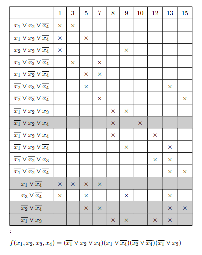

# Булева алгебра

---

## Використання

* Клонуємо репозиторій в локальну теку
```bash
git clone https://github.com/Pasha-Makarenko/Boolean-algebra.git
```
* Завантажуємо [Node.js](https://nodejs.org/en)
* В головному файлі `index.ts` в теці `src` використовуємо методи з імпортованих класів
* В консолі пишемо команди:
```bash
npm install
npm run build
npm run start
```

Перед використанням програми створіть файл `.tex` з таким макетом:
```tex
\documentclass{article}
\usepackage[left=2.5cm,right=1.5cm,top=2cm,bottom=2cm,bindingoffset=0cm]{geometry} % поля
\usepackage{type1ec}
\usepackage[T1,X2,T2A]{fontenc} 
\usepackage[utf8]{inputenc}
\usepackage[english,ukrainian]{babel} 
\usepackage{colortbl} % фарбування рядків таблиці
\usepackage{tikz} % малювання таблиць
\pagestyle{empty} % скасування нумерації сторінок

\begin{document}
% контент документу
\end{document}
```

Якщо у вас є математичний вираз, то його слід записати ось так:

```tex
\begin{math}
% вираз
\end{math}
```

або так:

```tex
$вираз$
```

Для цього у класі `LatexFormater` в об'єкті `math` є методи `area` і `brackets` відповідно. \
`LatexFormater` - клас, який мітсить базові методи для написання `Latex` коду
---

## Диз'юнктивна та кон'юнктивна нормальні форми

Для перетворення булевих функцій в нормальні форми в головному файлі `index.ts` імпортуємо два класи із файлу `normalForm.service.ts`

`index.ts`:
```ts
import NormalFormService from "./normalForm/normalForm.service"
import NormalFormFormater from "./normalForm/normalForm.formater"
import LatexFormater from "./latex/latex.formater"
```

`NormalFormService` - клас, який містить алгоритми обчислення \
`NormalFormFormater` - клас, який перетворює об'єкти та масиви в код `Latex`, який можна використати в файлі `.tex`, а потім конвертувати в `pdf` документ.


### ДДНФ та ДКНФ

Клас `NormalFormService` містить метод `pnf` (Perfect Normal Form), який повертає масив імплікант. 
Аргументами приймає два параметри: кількість змінних функцій і масив наборів. 
Бо цей метод фактично повертає набори у двійковій системі числення, то не важливо буде це ДНФ чи КНФ.

Уявимо ситуацію, задана функція `f(x1, x2, x3, x4) = 0` на наборах `1, 3, 5, 7, 8, 9, 10, 12, 13, 15`.
Тоді для знаходження ДКНФ ми в коді напишемо:

```ts
const array = [1, 3, 5, 7, 8, 9, 10, 12, 13, 15]
const cnf = NormalFormService.pnf(4, array)
```

Але якщо ми хочемо знайти ДДНФ, то в метод `pnf` ми повинні передати ті набори, яких немає в `array`. 
Звісно їх можна вводити вручну, але для зручності у класі `NormalFormService` є метод `exclude`, який інвертує масив наборів.
Цей метод приймає два параметри: кількість змінних та масив наборів, який ми інвертуємо.
Тоді при заданій умові задачі вище ДДНФ знайдеться так:

```ts
const array = [1, 3, 5, 7, 8, 9, 10, 12, 13, 15]
const dnf = NormalFormService.pnf(4, NormalFormService.exclude(4, array))
```

Ці два методи хоч і повертають шукані нормальні форми, але у вигляді масивів. Щоб отримати код `Latex` використаємо клас `NormalFormFormater`.
Використаємо метод `nf` який створить нормальну форму. Цей метод приймає три обов'язкових параметри: тип нормальної форми: `"con"` - для КНФ `"dis"`- для ДНФ, кількість змінних та власне саму нормальну форму. 
Також у нього є необов'язкові параметри, це назва функції та назва змінної. \
Використання цього методу і результат виведемо в консоль:

```ts
const array = [1, 3, 5, 7, 8, 9, 10, 12, 13, 15]
const cnf = NormalFormService.pnf(4, array)
const dnf = NormalFormService.pnf(4, NormalFormService.exclude(4, array))

console.log(NormalFormFormater.nf("dis", 4, dnf))
console.log(NormalFormFormater.nf("con", 4, cnf))
```

Тепер в консолі виведеться результат, який можна скопіювати й використати.
Але при використанні цього результату в файлі `.tex` слід використати відповідну команду, яка була описана у пункті "Використання".

```ts
const array = [1, 3, 5, 7, 8, 9, 10, 12, 13, 15]
const cnf = NormalFormService.pnf(4, array)
const dnf = NormalFormService.pnf(4, NormalFormService.exclude(4, array))

console.log(LatexFormater.math.area(NormalFormFormater.nf("dis", 4, dnf)))
console.log(LatexFormater.math.area(NormalFormFormater.nf("con", 4, cnf)))
```

### МКНФ та МДНФ

Алгоритм пошуку МНФ це метод Квайна. Так, як і з `pnf` класом `NormalFormService` містить метод `mnf` і по аналогії ми можемо вивести мінімальні нормальні форми:

```ts
const array = [1, 3, 5, 7, 8, 9, 10, 12, 13, 15]
const cnf = NormalFormService.mnf(4, array)
const dnf = NormalFormService.mnf(4, NormalFormService.exclude(4, array))

console.log(LatexFormater.math.area(NormalFormFormater.nf("dis", 4, dnf.result)))
console.log(LatexFormater.math.area(NormalFormFormater.nf("con", 4, cnf.result)))
```

На відмінність від `pnf`, метод `mnf` повертає об'єкт:

```ts
{
  result, // власне сама мінімальна нормальна форма. Як раз це поле було використано у коді вище
  selections, // етапи склеювання
  pnf, // досконала нормальна форма, яка була як допоміжна
  sets // використані набори, що нас не цікавлять
}
```

Якщо ми хочемо вивести етапи склеювання, то використаємо метод `selections` із класу `NormalFormFormater`.
Цей метод приймає два обов'язкових параметри: тип нормальної форми: `"con"` - для КНФ `"dis"`- для ДНФ, та етапи склеювання.
Також у нього є необов'язковий параметр, це назва змінної. 

```ts
const array = [1, 3, 5, 7, 8, 9, 10, 12, 13, 15]
const cnf = NormalFormService.mnf(4, array)
const dnf = NormalFormService.mnf(4, NormalFormService.exclude(4, array))

console.log(LatexFormater.math.area(NormalFormFormater.selections("dis", dnf.selections)))
console.log(LatexFormater.math.area(NormalFormFormater.selections("con", cnf.selections)))
```

Мінімізація нормальних форм реалізована на основі методу Квайна, тому нам також необхідна таблиця. Для цього клас `NormalFormFormater` містить метод `quineTable`.
Цей метод приймає два обов'язкових параметри: тип нормальної форми: `"con"` - для КНФ `"dis"`- для ДНФ та мінімальну форму (зверніть увагу, не тільки поле `result`, а весь об'єкт).
Також цей метод приймає один необов'язковий параметр: це об'єкт налаштувань:

```ts
{
  isSets: boolean, // за замовченням true. Якщо це поле true, 
    // то в верхньому рчдку імпліканти будуть записані у вигляді номерів 
    // (це потрібно для зменшення розміру таблиці)
  arg: string, // назва аргументу
  char: string, // символ "хрестика"
  showZeroSelection: boolean, // за замовченням false, відображає усі імпліканти з дозконалої нормальної форми
  showUsedImplicants: boolean, // за замовченням false, відображає усі використані імпліканти, 
    // тобто ті, що були використані при склеюванні
  core: { // налаштування рядків імплікант, які йдуть у ядро (тобто у результуючий запис МНФ)
    color: string, // за замовченням "gray", колір заливки комірок
    opacity: number // за замовченням 0.8, прозорість заливки від 0 до 1, 
    // де 0 - абсолютно прозора, 1 - абсолютно непрозора
  }
}
```

Власне отримання таблиці:

```ts
const array = [1, 3, 5, 7, 8, 9, 10, 12, 13, 15]
const cnf = NormalFormService.mnf(4, array)
const dnf = NormalFormService.mnf(4, NormalFormService.exclude(4, array))

console.log(NormalFormFormater.quineTable("dis", dnf))
console.log(NormalFormFormater.quineTable("con", cnf))
```




Хоча алгоритм є методом Квайна, але окріб таблиць у насє  можливість побудува карти Карно на основі вже голової МДНФ чи МКНФ.
Для цього клас `NormalFormService` містить метод `karnaughMap`.
Цей метод приймає три обов'язкових параметри: `count` - кількість змінних, `sets` - набори, при яких функція дорівнює 1, `headers` - заголовки таблиці.

Детальныше про `headers`:

```ts
{
  rows: Array<Array<number>> // заголовки рядків
  columns: Array<Array<number>> // заголовки стовпців
}
```
Клас `NormalFormService` містить метод `defaultHeadersKarnaughMap`, який повертає заголовки для таблиці Карно за часовою стрілкою.

Цей метод повертає такий об'єкт:

```ts
{
  result, // матрицю нулів і одиниць
  headers // власне самі заголовки
}
```

Залишилось лише отримати таблюцю у вигляді коду `Latex`. Для цього використаємо метод `karnaughMap` класу `NormalFormFormater`.
Він приймає два обов'язкових параметри: тип нормальної форми: `map` - результат методу `karnaughMap`, `mnf` - мінімальна нормальна форма.
Також у нього є необов'язковий параметр налаштувань:

```ts
{
  arg: string // за замовченням: "x", назва аргументу, який буде виведений у заголовку таблиці
  line: { лінія, яка охорлює окремий заголовок
    offset: number // за замовченням: 0.2, відступ від таблиці
    padding: number // за замовченням: 0.2, обрізання по краям
  }
  area: { // за замовченням: , області імплвкант, яку будть обводидись
    colors: Array<string> // колір обводки
    padding: number // за замовченням: 0.2, відступ від стінок комірок
    borderRadius: string // за замовченням: 5pt, радіус закруглення
    thickness: string // за замовченням: "thick", товщина лінії
  }
}
```

Власне отримання карти Карно:

```ts
const array = [1, 3, 5, 7, 8, 9, 10, 12, 13, 15]
const map = NormalFormService.karnaughMap(4, NormalFormService.exclude(4, array), NormalFormService.defaultHeadersKarnaughMap)
const cnf = NormalFormService.mnf(4, array)
const dnf = NormalFormService.mnf(4, NormalFormService.exclude(4, array))

console.log(NormalFormFormater.karnaughMap(map, dnf))
console.log(NormalFormFormater.karnaughMap(map, cnf))
```

